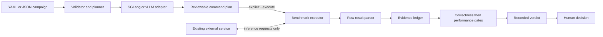
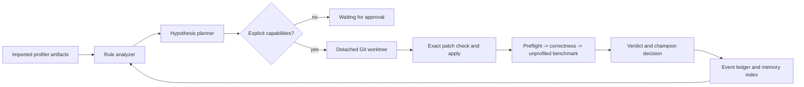

# Architecture

Euboulia turns a declared inference benchmark into inspectable evidence and a
gate result. Its architecture deliberately separates deliberation from service
control: it can recommend a candidate, but a human decides whether and how to
act on that recommendation.

## Invariants

1. Planning is safe and non-executing by default.
2. Benchmark execution requires explicit `--execute` authorization.
3. Euboulia owns only benchmark-client processes it starts, never the configured
   SGLang/vLLM service.
4. Correctness is evaluated before performance.
5. Baselines, failures, raw outputs, normalized metrics, and verdicts remain
   available for audit.
6. Framework CLI churn is contained inside adapters.
7. Profile-derived values are diagnostic-only and cannot promote a candidate.
8. Schema-v2 workspace writes and evaluator execution are separate capabilities.
9. Every active candidate starts from a pinned revision in a detached worktree.

## Data flow



The service is an external prerequisite, not a child of Euboulia. The benchmark
executor sends the declared workload to its configured endpoint and writes only
experiment evidence.

The schema-v2 runtime is a sidecar rather than a rewrite of that path:



Profiler, analyzer, planner, patch workspace, evaluator, and memory communicate
through frozen typed records. The explicit runner state machine is the only
orchestrator. A general agent framework is not a dependency.

## Components

| Component | Responsibility | Boundary |
| --- | --- | --- |
| CLI | `doctor`, `plan`, `run`, `evaluate`, and `history` | Does not silently escalate from inspection to execution |
| Config loader | Safe YAML/JSON loading and schema validation | Rejects malformed or unsupported input before planning |
| Planner | Expands the baseline and candidates into deterministic trials | Does not infer undeclared server changes |
| Framework adapter | Builds an argument vector and expected result path; parses native output | Does not manage framework service lifecycle |
| Executor | Runs an approved benchmark child with a timeout and scoped environment | May terminate only the child it started |
| Parser | Preserves native output and emits normalized numeric metrics | Does not erase unknown native fields needed for audit |
| Artifact store and ledger | Stores run evidence and append-only experiment records | Never doubles as a source-editing workspace |
| Gate evaluator | Applies correctness, direction, improvement, and regression rules | Produces a verdict, not an operational rollout |
| Human control | Reviews commands and decides what follows a verdict | Remains the final authority |
| Optimization event ledger | Stores typed, append-only stage transitions and artifact digests | Remains separate from the experiment-only ledger |
| Imported profiler | Normalizes Torch, NSYS, and NCU exports | Never starts server profiling and never emits promotion metrics |
| Rule analyzer | Produces ranked findings with confidence, evidence, and caveats | Findings are hypotheses, not causal proof |
| Hypothesis planner | Selects a reviewed patch catalog entry and deduplicates memory | Does not edit files or emit shell commands |
| Patch workspace | Creates a detached worktree and strictly checks/applies one patch | Never edits or commits the user's branch; retains failed evidence |
| Tiered evaluator | Runs finite argv commands in fail-fast order | Cannot manage a persistent service or promote a profiler trial |
| SQLite memory | Indexes accepted, rejected, invalid, and failed outcomes by context | Derived and rebuildable; not the audit source of truth |

## Experiment lifecycle

1. **Validate.** Load `schema_version: 1`, resolve scoped paths, and reject an
   unknown framework, gate direction, or malformed candidate.
2. **Plan.** Treat the first candidate as the baseline and render every benchmark
   as a structured command plus its expected result location.
3. **Review.** Show endpoints, arguments, environment, paths, timeouts, and gates.
   `plan` and `run --dry-run` stop here.
4. **Execute.** Only `run --execute` starts benchmark-client subprocesses. The
   external server remains untouched.
5. **Collect.** Retain native output and parse normalized metrics such as
   `success_rate` and `output_throughput`.
6. **Gate.** Reject a candidate that fails correctness. Only then compare its
   performance metric with the baseline in the declared direction.
7. **Persist.** Append the experiment status, metrics, provenance, and verdict to
   the ledger, including failures and rejections.
8. **Decide.** A human reviews the evidence and chooses whether to run more trials
   or make a separately controlled operational change.

## Configuration and data model

A campaign contains a `Workload`, benchmark mode, ordered `Candidate` values,
gates, and execution settings. The first candidate is always the baseline.
Candidate parameters belong to the benchmark client; they are not server flags.
An optional schema-v1 `patch` is descriptive metadata and is never applied.
Schema v2 instead refers to an explicit reviewed patch catalog. Its planner
selects a catalog entry, and the workspace independently validates its bytes,
paths, modes, symlink traversal, changed-file count, changed-line count, base
revision, and `git apply --check` result before a separately authorized write.
When a candidate changes concurrency, request rate, token lengths, or another
load dimension, its result describes a capacity search and must not be labeled a
code speedup. Code or server-tuning comparisons keep the model, workload,
hardware, framework build, and measurement policy constant.

Runtime records separate the declared inputs from observed state:

- **Workload** identifies the model, token lengths, dataset, request count,
  concurrency, and endpoint.
- **Candidate** identifies benchmark parameters, a scoped environment delta, and
  optional patch metadata.
- **Metrics** retains normalized values alongside native result data.
- **Experiment** records the workload, candidate, command, timing, status, and
  artifact provenance.
- **Verdict** records gate inputs and the reason a candidate passed, failed, or
  could not be evaluated.

Dataclasses serialize to dictionaries and JSON so the ledger does not depend on
Python object identity. Human-authored YAML remains a supported input and is
normalized through the same model.

## Adapter contract

An adapter has two narrow jobs:

1. turn a validated framework-neutral workload and candidate into an
   `argv: list[str]`, benchmark type, and result path; and
2. parse that framework's output without discarding the raw record.

Adapters must not return shell snippets, mutate global process state, probe for
or kill services, or apply a candidate patch. This boundary makes CLI changes in
SGLang or vLLM local to one module and keeps planning testable without GPUs or a
live endpoint.

## Evidence layout

Paths are resolved relative to the campaign file. A logical layout is:

```text
<artifacts-dir>/
├── ledger.jsonl
└── <run-id>/
    ├── plan-and-config-snapshot
    ├── baseline/
    │   ├── raw-result
    │   └── normalized-metrics
    ├── candidates/<candidate-id>/
    │   ├── raw-result
    │   └── normalized-metrics
    └── verdict
```

The exact filenames may evolve while the project is in alpha. The durable
contract is that a record links declared inputs, the executed argument vector,
raw evidence, normalized metrics, status, and verdict. Completed evidence should
be treated as immutable; later analysis produces a new record rather than
rewriting history.

A schema-v2 run additionally uses:

```text
<optimization-artifacts>/
├── events.jsonl                 # canonical stage trajectory
├── memory.sqlite3               # rebuildable query index
└── <run-id>/
    └── evaluations/<trial-id>/  # command logs, metrics, and verdict

<workspace-root>/<run-id>/<iteration-id>/
├── evidence/                    # manifest, checked patch, diff, command logs
└── worktree/                    # detached candidate; never auto-deleted
```

## Reproducibility

The ledger is necessary but not sufficient. Meaningful comparisons also pin or
record the framework and Euboulia commits, model revision, accelerator and
driver versions, host topology, environment, dataset seed, request arrival
policy, warmup, and trial ordering. Baseline and candidate trials should be
interleaved and repeated when thermal, caching, compilation, or network effects
can bias a result.

## Relationship to Entelechy

Euboulia ends at evidence and a human-governed recommendation. Entelechy, if an
operator chooses to use it, may consume an approved portable record in a later
realization workflow. There is no import, runtime, service, storage, or control-
plane dependency between the projects.

## Extension points and limits

New benchmark modes and native result formats belong in adapters. New statistical
tests and gates belong after evidence normalization. New profiler formats belong
in offline importers without weakening raw-data retention.

The current rules runtime selects only pre-reviewed exact patches; it does not
generate free-form code, tune a live server in place, control deployment, resume
an interrupted side effect, or prove causality from a single trial. Persistent
service lifecycle, external model calls, containers, remote GPUs, and deployment
each require a new capability, threat model, least-privilege executor, rollback
mechanism, and audit record.
