# Architecture

Euboulia is a two-level SGLang optimization agent. The outer loop finds and validates
the best system-level opportunity; the inner loop produces a faster, numerically
correct implementation for the selected hot operator.

## System boundary

The agent may analyze evidence, choose a reviewed hypothesis, create an isolated
trial, and evaluate it. It may not invent production authority from those actions.

```mermaid
flowchart LR
    C["Champion SGLang"] --> W["Workload suite"]
    W --> N["NSYS profile"]
    N --> A["System/operator attribution"]
    A --> R["Highest-ROI hotspot"]

    subgraph K["Hot-operator inner loop"]
        D["Operator contract + real shapes"] --> G["Generate CUDA/Triton"]
        G --> B["Compile"]
        B --> V["Numerical correctness"]
        V --> M["Microbenchmark"]
        M --> U["NCU analysis"]
        U --> J{"Inner gate"}
        J -->|revise| G
    end

    R --> D
    J -->|best valid kernel| I["Integrate into SGLang"]
    I --> E["End-to-end A/B"]
    E --> Q{"Promotion gate"}
    Q -->|win| C
    Q -->|reject| H["Negative evidence"]
```



The primary managed path is SGLang. A compatibility path can benchmark an existing
external SGLang or vLLM endpoint, but it never controls that service.

## Domain model

| Concept | Meaning |
| --- | --- |
| Scenario | Fixed model, runtime, hardware, dataset, workload matrix, measurement policy, and gates |
| Finding | Evidence-backed description of a system or operator bottleneck, including workload contribution and caveats |
| ROI target | The hotspot selected using end-to-end contribution and expected optimization headroom |
| Kernel task | Operator semantics, reference path, real shapes, hardware target, tolerances, and objective |
| Kernel candidate | Generated CUDA/Triton implementation plus build, correctness, benchmark, and NCU evidence |
| Hypothesis | One engine or kernel change intended to address a finding |
| Trial pair | Fresh baseline and candidate materialized from the same pinned source revision |
| Champion | Best end-to-end-valid SGLang revision under the fixed scenario |
| Verdict | Gate result derived from unprofiled correctness and performance evidence |
| Memory | Rebuildable index of accepted, rejected, invalid, and failed hypotheses |

These identities must remain separate. In particular, changing both the workload and
the implementation does not establish an implementation speedup.

## Components and implementation status

| Layer | Responsibility | Today |
| --- | --- | --- |
| Scenario/workload runner | Launch SGLang and execute reproducible workload suites | Foundation implemented |
| System profiler and ROI selector | Capture NSYS and rank system/operator hotspots by end-to-end value | Offline import and rule analysis implemented; active profiling/ROI policy incomplete |
| Kernel-task extractor | Convert a hotspot and observed calls into an executable operator contract and real shape set | Not implemented |
| Kernel optimization agent | Generate and revise CUDA/Triton implementations | Not implemented |
| Kernel validators | Compile, check numerics, microbenchmark real shapes, and analyze NCU | Individual command infrastructure exists; closed inner loop not implemented |
| SGLang integrator | Materialize the kernel/engine change in an isolated candidate tree | Exact reviewed patch flow implemented; generated-kernel integration incomplete |
| End-to-end evaluator | Run fresh baseline/candidate services and point-aware gates | Implemented |
| Champion/re-profile controller | Promote a winner and profile the changed system again | Champion evidence exists; automatic re-profile loop not implemented |
| Event ledger and memory | Preserve evidence and recall positive/negative outcomes | Implemented |

Frozen typed records connect the components. The runner's explicit state machine is
the orchestrator; a general agent framework is not required.

## Managed SGLang lifecycle

Every optimization iteration compares two independent materializations:

```text
baseline:  pinned worktree -> optional build -> fresh server -> evaluate -> stop
candidate: pinned worktree -> reviewed change -> optional build -> fresh server
           -> evaluate -> stop
```

The candidate starts only after the baseline process has stopped. Both sides use the
same source revision, scenario, and measurement policy. Readiness failure, benchmark
failure, interruption, or an exception still enters owned-process teardown through
`finally`.

The controller never discovers a process by name or port. A signed handle binds the
exact PID, process group, start identity, run, trial, command digest, endpoint, and
log paths. This is the only identity that can be stopped.

## Evaluation semantics

For each fresh service, Euboulia runs correctness before interpreting performance.
The workload suite then evaluates every named ISL/OSL/concurrency point. The suite
gate can require all points to be valid, designate primary points, require a minimum
improvement, and limit regression elsewhere.

Profile traces can perturb timing, so they select hypotheses but cannot decide
promotion. A candidate must pass a separate unprofiled evaluation.

The shared SGLang harness contract receives the active endpoint, model identity,
workload point, warmup/repetition policy, and output path through explicit
environment values. Model-specific semantic evaluation remains separately declared;
a successful smoke request is not an accuracy result.

## Evidence and feedback

The canonical record links:

- scenario and normalized configuration;
- source, model, and runtime provenance;
- exact commands and reviewed change digest;
- service lifecycle and command logs;
- raw profile and benchmark artifacts;
- normalized point metrics and suite verdict; and
- accepted, rejected, invalid, or failed outcome.

Optimization events are append-only. SQLite memory is a query projection and may be
rebuilt. Large artifacts are referenced by path, size, and SHA-256 instead of being
embedded in events.

Recursive improvement has two concrete feedback paths. Inside the operator loop,
compiler errors, numerical mismatches, microbenchmarks, and NCU counters drive the
next kernel revision. Outside it, the end-to-end winner becomes champion and is
profiled again because accelerating one operator changes the system bottleneck.
Memory prevents repeated failures and supplies prior evidence, but it is auxiliary to
these two measured feedback paths. None of this updates model weights or grants
deployment authority.

## Two recipe generations

- **Schema v3** is the current optimization contract. It separates model artifacts,
  endpoint, workload suite, target/runtime identity, reviewed changes, evaluation,
  budgets, and evidence storage.
- **Schema v2** is accepted as a one-point compatibility input.
- **Schema v1** is the older benchmark-only path for an existing external service.
  Candidate `patch` values in v1 are inert metadata and are never applied.

New SGLang optimization scenarios should use v3.

## Extension direction

The implementation order follows the missing links in the primary loop: active NSYS
capture and ROI selection, kernel-task/shape extraction, isolated CUDA/Triton
generation, compile/correctness/microbenchmark/NCU iteration, integration, and
champion re-profiling. Managed vLLM and deployment orchestration remain outside the
current focus.

See [Optimization runtime](optimization.md) for operation and [Safety model](safety.md)
for authorization and ownership rules.
