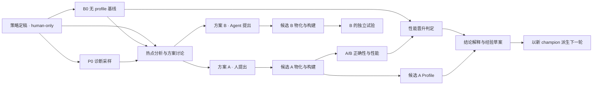
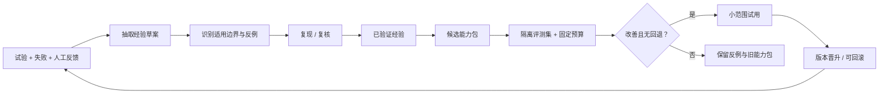
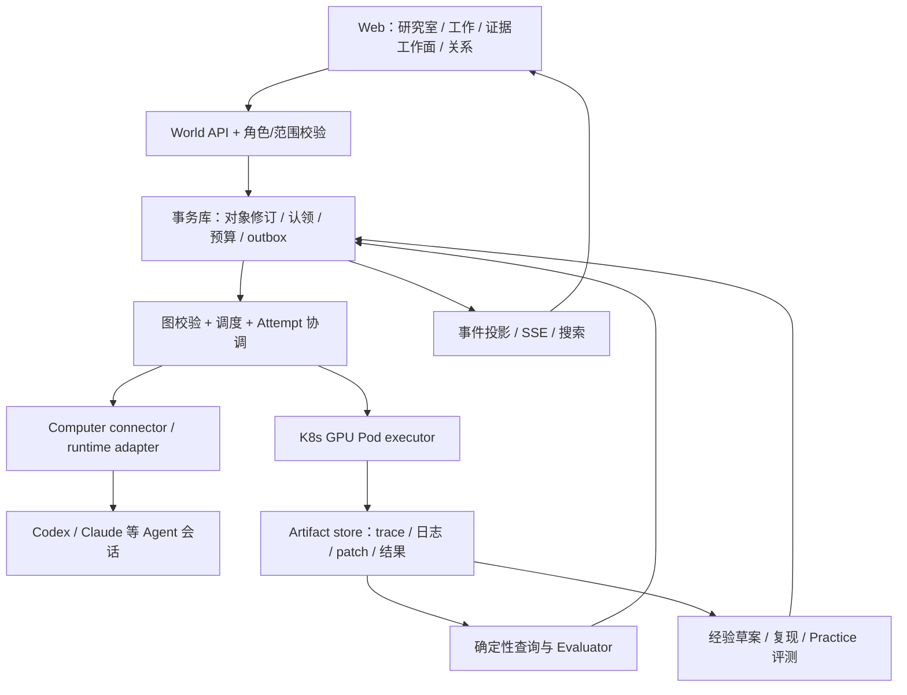

# Euboulia：团队共同进化的推理优化世界

状态：产品设计提案 v0.2，2026-09-07。本文定义目标形态；不表示这些能力已经在生产运行。

原始需求见 [draft.md](draft.md)。[共享研究室原型](prototypes/inference-world/index.html) 验证讨论、证据引用、任务接力和介入体验；[v0.1 任务图原型](prototypes/inference-world/network.html) 保留用于检查执行契约。两者使用独立演示状态，都没有连接真实 Agent、GPU 或模型 API。

## 0. 这次重新设计的起点

上一版把系统结构放到了用户面前：先认识 Goal、Task、Attempt，再操作 DAG，最后打开检查器讨论。用户承担了拆分、连线、分派和推进的工作。虽然存在 Agent 对象，日常体验仍然围绕手工管理流程展开。暗色画布与发光连线进一步放大了这种距离。

上一轮确实查过 Raft 文档，但没有成功读取用户提供的登录后实例，也没有把协作方式落实为主交互。本轮实际查看了该实例的 Computers 列表、Computer 详情、成员列表、频道，以及同一频道的聊天和任务切换。看到计算机内列出可用 runtime 和所属 Agent，成员中人和 Agent 并存，聊天输入框旁有“作为任务”。没有创建或发送任何 Raft 任务，也没有改动机器配置。

Raft 的官方说明强调持久身份、共享频道、成员间任务协作以及本地工作环境。本设计从中提炼出四项产品原则；以下是 Euboulia 的设计判断，而非对 Raft 未观察能力的推断。来源：[Welcome](https://docs.raft.build/welcome/)、[Channels](https://docs.raft.build/features/messaging/channels/)、[Runtime](https://docs.raft.build/features/agents/runtime/)、[Computers](https://docs.raft.build/zh-cn/features/server/computers/)。

| 学到的机制 | Euboulia 中直接改变的行为 |
| --- | --- |
| 人和 Agent 共享持续上下文 | 默认进入研究室，直接看到讨论、发现、证据和下一步；可以随时加入讨论 |
| 有身份的队友持续工作 | 日常显示队友的职责、正在做什么、需要什么；模型选择放进成员详情 |
| 讨论自然成为工作 | 一段消息可以交给队友；引用的 trace、实验、代码与原讨论随任务传递 |
| Computer 是实际工作位置 | 注册一次后长期提供环境；GPU 池单独呈现，实验通过 Pod 执行 |

**新的产品承诺：你说清楚值得解决的问题，团队组织研究、执行和证据；你随时看进去、改变方向、接手一段工作。**

“AI 原生”在这里要能被操作检验：如果换掉模型，删掉动画，用户依然能把有上下文的工作交出去，离开后再接上，知道为什么要介入。具体任务图由工作过程持续生成；图用于解释依赖和影响，而研究室负责承载协作。

Euboulia 仍要提供推理研究的专业工作面。讨论中的测量结果可展开成可比性检查，Trace 引用可定位 rank 和时间窗，代码建议可打开 diff；更换 workload 要创建新场景身份。聊天里说“完成了”不会代替测量证据和验收。

## 1. 世界为什么存在

**Euboulia 是人和 Agent 共同工作的推理优化实验室：把问题变成可检验的假设，把算力变成可信证据，把一次试验变成团队下次可以复用的能力。**

团队今天的损耗不只发生在 kernel 上，还发生在寻找可用机器、重建环境、重复踩坑、解释不可比的数字、交接上下文和找回某次实验结论上。这个世界把上述工作纳入同一条因果链。

一个成员离线、一个 Agent 换模型、一个 Pod 被回收，都不应让团队失去实验身份、结论或下一步。世界持续存在；参与者和执行环境可以更换。

成功的直观体验：新成员提出“把 DSV4 在 H20 上的长上下文推理做快”，系统能找到已有策略、基线、反例和可用资源，协助制定下一次有价值的试验。做完后，另一位成员能知道改了什么、为什么有效、在哪些条件下有效，并复现它。

### 不变的内核

| 原则 | 世界中的具体约束 |
| --- | --- |
| 人和 Agent 都是一等参与者 | 使用同一种任务、讨论、提案、产物和归因机制；准入、角色、预算分别建模 |
| 目标定义价值 | 固定优化对象、工作负载、主指标、正确性、回退约束、预算和截止条件 |
| 产物连接工作 | 下游依赖已验收且有版本的产物，不依赖“有人说做完了” |
| 假设必须可被否定 | 每项优化说明预测、验证办法和放弃条件；缺证据允许成为独立采样任务 |
| 证据决定结论 | Profile 用于诊断；晋升依赖独立、可比、无 profiling 的测量 |
| 历史不可悄悄改写 | 策略、任务图、方案、运行、经验都有版本；修改产生新的版本或尝试 |
| 算力和注意力都是有限资源 | 预算、资源租约、并发、停止规则进入调度；空闲时不靠模型持续轮询 |
| 知识有适用边界 | 一次成功不会变成全局定律；失败、矛盾、失效和未知都可被检索 |
| 进化本身需要验证 | 系统改进有独立评测、试用和回滚；优化器不能自行放宽自己的验收标准 |

“平等”体现在参与协议与贡献认可。管理员与普通成员的权限、某项任务的 human-only 准入，以及资源所有者的授权仍然有效。

## 2. 世界的对象与关系

### 2.1 后台对象与用户词汇分层

以下对象是执行与追溯的模型，用户无需先掌握它们。默认界面只暴露“研究室、队友、工作、产物”；修订、尝试、租约在详情里按需解释。

| 对象 | 回答的问题 | 生命周期与重要字段 |
| --- | --- | --- |
| 世界 Workspace | 谁在共同工作？ | 成员、管理员、共享范围、默认策略、经验空间 |
| 研究室 Room | 在哪里一起推进问题？ | 讨论、成员、关联目标、工作、产物和固定上下文；允许多个话题线程 |
| 目标 Goal | 为什么做、做到什么算完成？ | owner、验收策略版本、scenario、预算、状态 |
| 场景 Scenario | 哪些结果可以比较？ | 模型/代码/容器/硬件/工作负载/协议的锁定身份 |
| 任务 Task | 哪一份工作需要交付？ | 输入输出契约、依赖、准入、预算、负责人与协作者 |
| 尝试 Attempt | 谁在哪次实际执行中做了什么？ | task revision、lease、executor、run、开始/结束、失败原因 |
| 成员 Member | 谁提出、执行和负责？ | human/agent、owner、role、能力、可用性；身份独立于 runtime session |
| 机器 Computer | Agent 的控制进程在哪里？ | 所有者、心跳、runtime 清单、连接、目录作用域 |
| 算力池 ComputePool | GPU 任务能在哪里运行？ | cluster、namespace、GPU 型号/数量、拓扑、租约、缓存状态 |
| 产物 Artifact | 输入与证据在哪里？ | 类型、摘要、SHA-256、大小、保留状态、生产者和读者范围 |
| 方案 Proposal | 要验证哪个优化假设？ | source=human/agent/joint、证据、改动、收益假设、验证计划、版本 |
| 候选 Candidate | 被测的具体系统是什么？ | 父版本、源 revision、patch chain、参数、模型及环境锁 |
| 判定 Verdict | 这次比较证明了什么？ | 逐点指标、正确性、统计口径、门槛、结论、可比性 |
| 经验 Experience | 下次什么时候该用这个结论？ | claim、适用范围、支持/反例、置信状态、失效条件 |
| 能力包 Practice | 团队现在采用哪套做法？ | skills、模板、采样/规划策略、评测与版本、发布记录 |

Computer 和 ComputePool 可以在 UI 中放在同一个“资源”入口，但不是同一对象。本地电脑可以运行分析 Agent，通过授权的集群连接创建远程 GPU Pod；Agent 不必驻留在每张 GPU 上。GPU 执行必须在 Pod 内，机器注册不会变成裸机 GPU shell 的入口。

### 2.2 同一个世界，四种图

1. **任务依赖图**：`requires_artifact` 决定执行顺序，必须是 DAG。`contains` 只负责目标/任务分组，不自动等于依赖。
2. **版本谱系图**：`derived_from` 表示代码和配置继承；多个改动合并时，记录主父版本及其他来源。每个新组合仍需独立测量。
3. **证据与经验图**：`supports`、`contradicts`、`applies_to`、`supersedes` 可以连接不同目标，允许逻辑上的循环引用。
4. **成员与资源图**：`owned_by`、`runs_on`、`can_execute`、`leased_to` 表示归属、能力与实时占用。

默认页面显示研究室讨论，任务图位于“关系”视图；选择其他关系是在切换同一份工作的投影。反馈通过新一轮任务表达，不向已经完成的依赖图中加入回边。所有视图共享稳定对象 ID，可互相定位。

## 3. 世界怎样开始运作

### 3.1 成员、机器、Agent 的加入

真人接受邀请后设置姓名、职责与可共享资源。机器登记通过一次明确的配对完成：本地 connector 以出站连接维持心跳，声明所在 Computer、可用 runtime、工作目录和可访问的集群；平台不接收整台机器的通用登录权限。

成员在自己的 Computer 下登记 Agent：名称、职责、runtime/provider/model、能力标签、允许目录/工具、日 token 预算、最大同时任务数。UI 可选择 Codex、Claude 等 runtime；只有适配器通过兼容测试的能力才能标成可用。允许管理员提供团队共享 Agent。

成员可修改或停用自己拥有的资源，管理员维护全局规则。移除 Computer 先进入 draining，停止分配新任务，再处理已拥有的尝试；历史运行和产物保留。离线、禁用、维护中、无空闲 GPU 是不同状态。

### 3.2 目标与模板

管理员创建、修改、归档目标；普通成员可以提交目标建议。这里按草稿的角色约束设计，后续若需要 Agent 管理员，也必须通过明确角色授予。

目标模板包含场景输入、默认任务子图、准入规则、产物 schema 和验收策略。实例化时复制并固定模板版本；之后升级模板不会修改进行中的目标。

目标修改分两类：名称、描述属于元数据；模型、工作负载、门槛或预算策略属于新修订。重要修订标记受影响任务，不能让旧证据自动满足新条件。产品中的“删除”默认归档；取消活跃执行使用单独操作。

### 3.3 动态任务图

每次插入任务、拆分子任务、增加依赖都生成 GraphRevision。服务端在一次事务中检查：引用存在、无环、产物类型匹配、发起者有权、预估预算在范围内、运行中的输入不被改写。多人同时修改时以预期 revision 检测冲突，展示差异后重放。

一个任务有一个负责的成员，允许多位协作者。讨论可以多人参与；真正运行绑定一个 Attempt 和租约。重试创建新的 Attempt，保留上一次的失败与产物。

任务状态：`draft → waiting_inputs → ready → claimed → running → validating → completed`。旁路状态包括 `waiting_resources`、`waiting_budget`、`needs_human`、`failed`、`cancelled`、`superseded`。后台保留结构化状态，界面同时展示状态及原因，例如“等待 Profile 的 raw trace”或“符合条件的 H20 已被占用”。

“完成”要求产物契约通过。进程退出码 0、Agent 最后一条回复和 Pod 状态都不能单独决定完成。

## 4. 用 DSV4 的目标走完一轮

以下是目标模板的建议实例，名称来自草稿；实际工作负载仍以版本化 recipe lock 为准。



1. **定策略**：真人选定 `examples/scenarios/dsv4-megamoe.yaml` 的修订，确认主评估点和正确性要求，交付锁定策略。Agent 可以准备草稿，human-only 的交付仍由符合准入的人完成。
2. **跑基线、采 profile**：两者依赖同一策略，可以进入并行就绪状态。若有两套足够隔离的 H20 资源可并发；若只有一套，调度器串行安排，避免 profile 干扰基线。
3. **分析**：先检查覆盖范围和证据质量。例如只有 16K/256、C1/N1 的短窗口摘要时，无法证明 256K/C16 的热点组成；补采本身可以是高价值任务。
4. **提出方案**：真人和 Agent 都可建立方案、引用 trace 区间或源码，讨论保留在任务中；选中方案生成固定修订。
5. **物化、验证**：固定父候选、patch 和环境，构建后执行正确性与无 profile 的 A/B。微基准收益只作为中间证据。
6. **解释收益**：候选 profile 与性能试验分开采集，用于解释瓶颈转移。profile 缺失不会伪装为性能回退；性能可先形成判定，机制解释仍显示“证据待补”。
7. **晋升与继续**：同时比较直接父版本和根 baseline；只有门槛通过才更新本场景的 champion 指针。并行分支的父版本若已过期，先补充与当前 champion 的比较，不能由最后完成者直接覆盖。胜者生成新一轮分析输入，失败者形成反例。
8. **团队沉淀**：把结论加工为有适用边界的经验，经过复核或再次复现后进入团队实践库。

任务 2 与任务 3 的并行是调度可能性，不是性能测量许可。跨机器比较还要核对型号、拓扑、软件、功耗/频率策略与背景负载；仅型号相同不代表结果可直接相减。

## 5. 调度：让任务找到合适的参与者和资源

### 5.1 两阶段匹配

先选能负责这项工作的成员，再为 GPU 尝试分配算力。能力标签不能替代实测可用性。

| 过滤阶段 | 条件 |
| --- | --- |
| 准入 | human-only / agent-only / either；角色、项目与产物访问范围 |
| 能力 | 需要的 framework、profile/parser、编译或 kernel 技能及其验证版本 |
| 执行环境 | connector 在线、runtime 可用、目标版本与允许目录可访问 |
| 资源 | H20 数量、显存、互联拓扑、namespace 配额、独占范围；由 K8s 资源状态再次确认 |
| 预算 | 目标剩余 GPU 时间、成员日 token、最大 wall time、失败次数、并发额度 |
| 排序 | 公平性、优先级、已有缓存和上下文亲和性；不能只让最活跃 Agent 抢完任务 |

认领采用数据库条件更新，签发有过期时间和 fencing token 的租约。重复投递不能创建重复 Pod；Pod UID、attempt ID 和执行清单关联。租约失效后先协调实际 Pod 状态，不能仅凭心跳超时把同一任务再跑一遍。

性能测量默认独占预先声明的干扰域：至少所需 GPU，必要时整节点、互联或关联服务。租约不是可靠隔离的全部；K8s 调度约束与运行前检查共同保证。并行分析、编译和独立实验由各自约束决定。

### 5.2 预算要诚实

token 不等于金额，也不等于 GPU 成本。分别记录 provider 输入/输出/缓存 token（可获得时）、金额或估算来源、GPU 秒与 wall time。按所配置时区维护每日预算。

派发前预留本次预算，结束后按实际用量结算并释放余量；达到阈值停止新任务，在安全边界中止当前 Agent 调用。provider 上报可能延迟，单次调用也可能超出剩余额度，UI 应显示“已用 / 已预留 / 未结算”。runtime 不提供可靠 token 计量时显示“无法精确计量”，用轮数、时间或费用阈值替代，不能宣称硬 token 上限已保证。

目标管理员决定执行政策：逐个选择方案，或授权在固定预算/改动范围内自动探索。普通构建、验证和重试在已选范围内连续执行；新增目标、变更验收、扩大范围不能从一句含糊的讨论中推导。

## 6. AI 原生的工作方式

### 6.1 共享研究室是工作入口

用户可以从一句目标、一段代码、一次异常实验、一个 trace 窗口开始。研究室先复用已有上下文；缺少阻止执行的条件时，只询问该条件。目标模板由 Agent 用来起草，不要求用户先把所有字段填完。

任务可以由真人或 Agent 在讨论中提出、认领、拆分和交接。单条消息、任务线程、证据卡片共享来源和稳定引用；工作完成后，产物回到原讨论。人类可在任何时点补充“先查 rank 间等待，别急着改 kernel”，随后看到新方向、哪些未开始的工作受影响、哪些正在执行的试验仍引用旧版本。

交互分为三种语义：

- **讨论**：问题、解释、反例与想法，默认不产生执行副作用。
- **交办**：明确把工作交给队友，或沿当前已授权目标继续推进；Agent 组织后续任务，不逐节点请人点开始。
- **改变执行范围**：涉及新硬件权限、超出预算或更换验收条件时，展示具体变更及影响，在实际执行边界取得授权。

普通的分析、构建、验证、补采和已授权重试连续推进。只有真正需要人的研究判断、权限或缺失输入时才打断。自动产出的计划应可编辑、暂停和回看。任务图在背后记录依赖；不要求用户每发一句话先操作一张结构化变更表。

### 6.1.1 Agent 的主动性怎样变成好用的体验

每个研究室有当前目标、最新结论、悬而未决的问题、可用证据和停止条件。Agent 被与自己工作有关的事件唤醒，查阅这些上下文后提出或执行下一步。有人在讨论代码不意味着所有 Agent 都要回复。

Agent 可主动发现证据缺口、提供反例、认领适合的任务、请求另一名队友复核。向人的更新优先表达“新发现 → 依据 → 对下一步的影响”，常规命令和重试折叠进工作详情。多个并行任务的更新在研究室聚合；未改变判断的后台事件不刷屏。

新加入的人或 Agent 应能通过“当前简报 → 决定与证据 → 原始记录”恢复工作。聊天总结是索引；原始实验、代码与关键决策始终可追溯。需要继续时，把证据对象和当前问题一起交给下一位队友。

### 6.2 Agent 身份、执行与上下文

Agent 有稳定身份、负责人、能力和经验引用。runtime 会话只是可更换的执行载体；中断后可从任务检查点恢复上下文，但工具副作用由平台协调，不能靠重新播放聊天来恢复 GPU 工作。

一次任务的 ContextPack 包括：目标及版本、锁定策略、已验收输入、最近决策、相关经验及反例、允许动作和剩余预算。大 trace 留在产物系统里，通过时间窗、rank、算子查询，避免把全量文件塞入 prompt。

Analyzer 负责解释和假设，查询程序负责统计，Evaluator 负责判定。可以让另一个成员审查重要结论；不把“不同 Agent 数量”当成独立证据，模型意见也不构成统计置信度。

后台通过任务就绪、@提及、产物到达、资源恢复等事件唤醒 Agent。空闲、等待人、等待预算、connector 离线分别呈现；不需要永远有模型调用在后台运行。

## 7. UI：研究室、工作与专业工作面

### 7.1 默认体验

布局为：紧凑的全局导航 → 研究室与队友列表 → 当前工作 → 按需展开的上下文详情。

默认页面打开最近的研究室，顶部呈现目标和需要决定的事项。主体是人和 Agent 的研究记录；工作、产物、关系是同一研究室的不同视角。消息与工作各有稳定入口，切换视图保留草稿和引用。进入证据或队友详情不丢失讨论位置。

全局入口为研究室、动态、团队、计算机、经验。动态回答“我离开后有什么改变、现在需要我做什么”；工作列表回答“谁在做、被什么阻塞”；计算机页面用于查看和管理长期执行环境。

### 7.2 一次实际操作应怎样发生

以“DSV4 的 decode 为什么慢”为例：

1. Julian 在研究室提出目标。团队复用 recipe、B0 和已有 profile。
2. Prism 提示单 rank 证据不足，并附可打开的等待窗口。Atlas 给出另一条 MHC 候选的实验对比。
3. 用户点击 Trace，在同一页面看到观察、可能原因和缺失证据。点“引用到讨论”，窗口引用进入输入框；无需复制整份日志。
4. 用户说“先查 rank 间等待”，可以直接交给 Prism。已有上下文随消息成为工作，工作回链到来源讨论。
5. 队友按授权范围补采、分析和复核。GPU 不可用时显示具体阻塞；已有资料的分析可继续。
6. 用户打开实验对比，看 TPOT、吞吐、测量范围及正确性状态。缺少数值正确性时只能保留候选。
7. 结论连同反例形成经验草稿。下一研究室按适用条件引用，不把一次收益当成全局规律。

原型用明确标识的固定示例演示这条交互链。自由文本会作为本地消息或待接力工作保存，不调用模型，也不伪造实时智能回复。

### 7.3 专业界面按工作需要展开

| 用户正在做什么 | 当前工作面 | 能继续采取的动作 |
| --- | --- | --- |
| 理解新进展 | 简短发现、来源和影响，相关队友可直接提及 | 追问、引用证据、交给队友、给出反例 |
| 检查性能判断 | 基线/候选对比、工作负载和缺失指标 | 打开来源、要求补测、保存带边界的经验草稿 |
| 调查等待 | Trace 的 rank、时间窗、统计、代码关联 | 引用窗口、补采、派生假设 |
| 审阅改动 | 假设、真实 diff、测试和放弃条件 | 定向反馈、接手修改、要求独立验证 |
| 跟进工作 | 负责人、实际执行状态、输入产物与阻塞原因 | 暂停、补充方向、接力、回到讨论 |
| 理解整体关系 | 研究问题、分支、依赖与证据关系 | 打开节点，追溯来源，检查受影响工作 |

UI 必须区分发现、假设、执行记录与已验证结论。模型推断不能只配一个绿色成功图标；数值也要给出可比较的范围。任务图、结果表和专业 Trace 界面都由同一份对象引用连接。

### 7.4 视觉与操作准则

- 提供雾白、石墨、奶油黄和暖绿四套可切换外观，默认雾白。导航、对话、证据、图表与弹窗共用主题变量；选择独立保存，切换不改变研究状态。阅读字号和对比度优先。
- 常驻输入区支持 Enter 发送、Shift Enter 换行、中文输入法、@ 队友、证据引用与“交给队友办”。发送后明确反馈消息保存或执行状态。
- 重要判断放在讨论中的可操作卡片，顶部提供直达入口；常规日志按需展开。
- 对话操作与卡片都可键盘访问，搜索支持快捷键。标签页可用左右方向键切换，Esc 关闭详情。
- 小屏隐藏次级侧栏，通过明确按钮展开；详情占用独立工作面。避免把桌面图缩成不可阅读的微型画布。
- 同一工作保留上下文、草稿、引用、来源和负责人。长任务关闭页面后仍由后端执行，刷新只恢复投影。
- 图视图允许观察分叉与汇合。生产图需由真实记录投影、按需聚合，不能预画固定网络假装它在思考。

### 7.5 原型的边界

v0.2 实现共享研究室、双研究室切换、队友详情、消息/任务、证据引用、实验对比、示意 Trace 窗口、方向选择、任务暂停/恢复、GPU 阻塞、经验草稿、搜索与浏览器本地持久化。关系页面是明确标识的示例概览；原 v0.1 任务图独立保留，状态不互通。

当前不实现真实模型推理、Agent 自主协商、消息流式输出、多人同步、Computer 配对、GPU 调度、原始 Trace 解析、真实代码 diff 和经验自动检索。仅有的性能数字与案例都是固定演示数据。自由文本任务保守地进入本地队列，尚不解析 GPU 需求或依赖。

下一阶段要把消息中的上下文引用接到现有 run/artifact，把一次真实任务的认领、进展、暂停请求和结果回写到研究室。不能以更丰富的假数据替代这一闭环。

## 8. 系统经验的 RSI：三个速度不同的闭环

这里将 RSI 定义为**团队方法经测量后的递归改进**。第一阶段改进上下文组织、工具、skills、任务模板和选择策略；模型权重训练不在本提案范围内。



### 8.1 试验层：这个候选更好吗

现有 outer/inner loop 继续存在。系统级先确定热点，再进行参数、引擎或算子尝试；算子级执行真实 shape 提取、编译、数值验证、microbench，必要时做 NCU，再回到无 profile 的端到端验证。

累计 GPU kernel 占比不能直接当成关键路径占比。预期收益要声明工作负载、关键路径贡献、可实现的局部加速及重叠假设。例如关键路径中 20% 的部分耗时减半，在其他项不变的理想模型下总延迟下降 10%；这不直接证明吞吐提升。证据不足时保留“待估算”，把降低不确定性的试验排入候选。

### 8.2 经验层：这个结论值得复用吗

经验记录最少包括：

```yaml
experience_id: exp-h20-communication-001
revision: 1
status: candidate
claim: "应先区分跨 rank 等待与通信搬运，再选择通信优化方案"
scope:
  framework: sglang
  model_family: deepseek-v4
  accelerator: H20
  topology: "需匹配实测拓扑"
  workload: "长上下文场景，具体点由 evidence 引用约束"
supporting_evidence: []
counterevidence: []
validation:
  reproduction_required: true
  independent_reviewer: null
invalidation_triggers: [runtime_changed, topology_changed, contradictory_trial]
```

这是结构示例，空 evidence 表示尚未证明。状态为 `candidate → verified → contested / stale → deprecated`；状态变化带理由和版本。基础设施失败与假设被否定分开记录，网络下载失败不会形成“该优化无效”的结论。

召回时先过滤权限与硬条件，再搜索精确场景和兼容场景。精确匹配可用于去重；兼容经验需要解释差异，仅作为迁移线索；相反证据必须同时出现。团队经验、成员个人笔记、单任务上下文分层，不能把私有记录自动升级成全队知识。

每次复用记录 experience revision、使用者、目标与后续结果。统计“被采用后节省了什么或避免了什么”，而不是把被检索次数当成正确率。

### 8.3 方法层：优化器本身变好了吗

把候选 skill、模板、采样策略或 planner prompt 打包为不可变 PracticeVersion。建立包含历史案例、未参与改写的留出案例及近期新案例的评测集。按相同模型/工具/预算比较旧版与新版，并保留每个案例结果。

评测至少覆盖：能否识别证据不足、能否避开已知反例、方案能否执行、正确性与回退、达到可信结论的时间和 GPU 成本。诊断回放不能证明真实硬件收益；需要的在线试验单独安排。

通过离线门槛后，对少量可控目标试用，观察适用场景与回退，再由管理员发布为团队默认版本。进行中的任务仍固定旧版本；支持一键回滚默认指针。若没有可用留出集，显示“尚未验证的方法改动”，不能自动晋升。

RSI 的递归发生在：运行产生经验，经验产生候选方法，评测筛选方法，下一轮运行验证方法。验收标准、权限边界和评测集管理独立于提出方法的 Agent；不得为了显示进化而降低门槛。

## 9. 实现架构与可恢复性

建议先采用模块化单体控制面，加独立 connector 与任务 worker。业务对象和持久事务先明确，再决定是否拆服务或采用额外编排框架。



后端建议的核心接口为 `rooms`、`messages`、`context-references`、`goals`、`graph-revisions`、`tasks/claim`、`attempts`、`artifacts`、`proposals/revisions`、`experiences`、`practices/evaluations` 与带游标的事件流。写入包含 expected revision 和幂等键；API 不接受 Agent 直接把任意任务标成门槛通过。

协作阶段需要可事务化的成员、租约、预算和对象存储；可以采用 PostgreSQL + 对象存储作为团队控制面。当前 SQLite 继续承担单用户本地模式或读模型。向量索引是可重建的搜索辅助，不成为经验真相源。

事件和业务写入通过 transactional outbox 一致提交，消费者按 event ID 去重。重连后按游标补事件；页面刷新不重新发起任务。不能仅凭“有事件日志”就宣称可以安全恢复全部副作用。

进程/connector 崩溃后，reconciler 对照 Attempt、租约、K8s Pod UID 和产物清单决定继续观察、恢复采集或创建新尝试。真实 Pod 是否还在运行由基础设施状态确认，不能把网络超时当成执行结束。

产物同步完成与 Pod 成功分别记录。对 raw trace 维护 retained / expired / missing / summary_only，显示其大小和校验结果；原始文件清理不应悄悄使证据引用失效。

## 10. 从现有项目走到这个世界

以下核对基于本提案起点的代码；产品提案不覆盖运行时既有文档。

| 已有基础 | 接入位置 | 需要补的能力 |
| --- | --- | --- |
| 本地任务队列与独立 controller | `src/euboulia/control.py` | 团队身份、租约、资源池、公平调度与多 Computer |
| 锁定 scenario 与兼容性身份 | `optimization/identity.py`、`facets.py` | 目标/策略版本与跨目标比较说明 |
| Profile/Analysis/Proposal 契约 | `optimization/contracts.py` | 来源、修订、范围、讨论、结构化收益假设 |
| 规则分析与 reviewed catalog | `profilers/analysis.py`、`optimization/planner.py` | 查询式智能分析、人的方案、源码生成适配器 |
| 隔离物化与端到端门槛 | `optimization/workspace.py`、`runner.py`、`evaluator.py` | 父候选继承、动态任务子图、champion 后续再采样 |
| append-only events 与 memory projection | `optimization/events.py`、`memory.py` | 多人事务、权限过滤、反例关系、Practice 评测与晋升 |
| 结果表格与图表 | `src/euboulia/web/index.html` | 目标导航、可交互网络、资源、讨论和经验页面 |

现有 `runner.py` 在接受候选后结束本次优化运行并要求新的 champion profile。现有 memory 是证据索引，不是已经工作的完整 RSI 系统。原始 trace 的保留与可靠续跑都必须作为真实工程任务推进。

### 阶段与验收

| 阶段 | 可交付的完整行为 | 验收依据 |
| --- | --- | --- |
| P0：共同语言与交互 | 共享研究室原型，检验目标表达、证据引用、交办和介入 | 不操作 DAG 也能发起工作，详情可回到来源；明确演示边界 |
| P1：单目标真实闭环 | 人定稿策略 → Pod baseline/profile → 分析 → 选一个方案 → A/B → 新版本下一轮 | 真实目标及完整产物、可比性、失败链、无重复 GPU 尝试 |
| P2：团队世界 | 邀请成员、登记 Computer/Agent/资源池，按准入和预算分配 | 多人并发认领、离线重连、租约恢复、隔离与预算测试 |
| P3：经验复用 | 经验带范围和反例进入下一目标，记录采用及复现 | 跨目标可重放案例；不兼容与私有经验不被误用 |
| P4：方法 RSI | 一个 Practice 改动通过留出评测、试用、晋升和回滚 | 对照结果、成本、回退记录，进行中的任务版本不漂移 |

首个试点使用草稿中的 DSV4/H20 目标，邀请两名真人，使用两个 runtime 的 Agent 与至少两套可隔离的 GPU 资源。先证明一次跨成员交接和下一轮复用，再扩展大规模自治探索。

### 衡量团队是否真的更快

核心指标：从提出问题到形成**可复现、可决策结论**的时间。配合记录每个有效改进的 GPU 小时/工程投入、实验可复现率、重复失败率、交接完成时间、错误晋升率以及经验复用后的有效率。所有指标注明样本数和观察窗口；阶段目标值需先采集团队现状后设定。

Agent 数、消息量、token 消耗和网络图节点数用于运维，不代表优化效率。自动经验提炼也可能降低知识质量，必须同时监测矛盾、失效与复现失败。

## 11. 参考实现与采用边界

资料核对于 2026-09-07。本次实际查看了用户提供的 [Raft 团队实例](https://app.raft.build/s/julian-agent-team/computers) 的计算机、成员与频道界面，并复核官方文档；观察范围与设计取舍见 §0。未观察真实任务执行和恢复，不能据此断言其底层实现。

| 参考 | 可借鉴的成熟机制 | Euboulia 的取舍 |
| --- | --- | --- |
| [Raft Computer](https://docs.raft.build/zh-cn/features/server/computers/) | 本地服务连接机器与协作空间，提供 Agent 执行位置 | 增加独立 ComputePool、GPU Pod 和资源租约；不混淆 control host 与 GPU worker |
| [Raft Agent](https://docs.raft.build/zh-cn/features/agents/) / [Runtime](https://docs.raft.build/features/agents/runtime/) | 持久成员身份、共享任务与不同 runtime | 身份不绑定单段会话；能力、准入与可靠计量分开处理 |
| [Raft Tasks](https://docs.raft.build/zh-cn/features/collaboration/tasks/) | 讨论转任务、单负责人认领与任务线程 | 在此基础上要求产物契约、DAG、租约和实验判定 |
| [MLflow Tracking](https://mlflow.org/docs/latest/ml/tracking/) | 将参数、代码版本、指标和产物归入可比较的 run | 保留独立 run 证据，补充长期目标、方案、经验和多轮谱系 |
| [LangGraph Persistence](https://docs.langchain.com/oss/python/langgraph/persistence) | 会话检查点与跨会话存储的区分 | 业务执行和副作用恢复由自己的 Attempt 协调负责，不把聊天恢复等同任务恢复 |
| [Perfetto](https://perfetto.dev/docs/getting-started/other-formats) | Chrome JSON 时间线与 SQL 查询 | 使用成熟 trace 工具处理时间事件，任务网络只表示工作和产物 |

这些是机制参考，不表示将全部框架引入依赖。Raft 的持久队友感、MLflow 的证据可比性、Perfetto 的时间线深度，结合推理领域的执行和判定契约，构成这版产品的方向。

## 12. 本轮需求覆盖清单

| 用户要求 | 设计落点 | 本轮可检查成果 |
| --- | --- | --- |
| 世界不变的内核思想 | §1 | 明确九条不变量及其实际约束 |
| 世界完整运作 | §2–6、§9 | 对象、角色、注册、模板、动态任务、准入、调度、预算、Pod、讨论和恢复 |
| 真人和 Agent 平等参与 | §1、§3、§6 | 统一成员协议，human-only 与角色授权仍有效 |
| 动态任务关系 | §2、§7 | 关系作为按需视图；旧任务图继续检验动态分支和依赖，日常操作从研究室开始 |
| AI 原生且易操作 | §0、§6、§7 | 共享上下文、直接交办、证据工作面、方向介入、草稿和小屏布局 |
| Baseline 延续与热点分析 | §4、§7、§8.1 | 双参照比较、采样覆盖与证据缺口、下一轮重新 profile |
| 团队经验与 RSI | §8 | 经验范围/反例/复现，能力包独立评测、试用、晋升和回滚 |
| 成熟产品参考 | §11 | 官方来源、实际观察限制与明确取舍 |
| 可落地实施 | §10 | 代码接点、分阶段完整闭环、验收和团队效率指标 |

待团队试点收集的事实：真实资源拓扑与隔离要求、runtime 用量可观测性、典型实验时长、人工审查容量、经验权限边界。上述未知不阻止 P0 设计；进入真实执行前必须被任务化解决。
